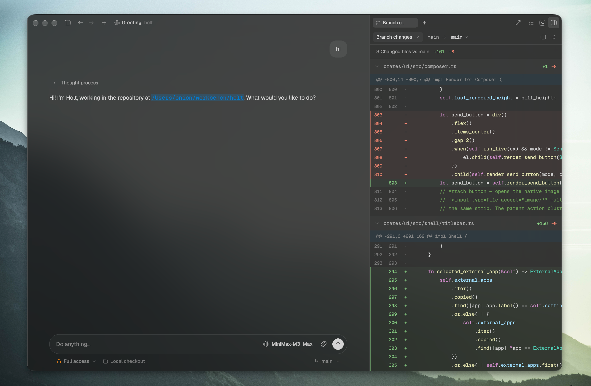

# Holt

A desktop coding agent built around a Rust UI and an in-process Rust agent loop:

- Holt is the only coding agent. Model services are configured as providers;
  local coding-agent CLIs are not interchangeable runtimes.
- No cloud — edge worker, multi-device sync, accounts/auth, updates, and the
  iOS/landing apps are deleted.
- No daemon/CLI — the app is headed-only and embeds its backend in-process
  over the memory RPC transport.

`crates/engine` adapts `pi-core-rs` behind Holt's typed `RpcService` boundary.

## Run

```bash
cargo run --release -p holt
```

Data lives under `~/.holt` (override with `HOLT_DATA_DIR`). Configure a provider
API key in Settings → Providers before starting a model run.

## Layout

See [ARCHITECTURE.md](ARCHITECTURE.md).

## Images

Attach local images or paste screenshots to preview, zoom, and pan in the
composer or Transcript. Sending provides local paths; the agent receives
pixels only when it calls `read`. PNG, JPEG, WebP, and first-frame GIF are
supported within a 25 MiB / 32-megapixel limit; APNG is unsupported. Preview
preserves source detail, while model input may be resized to 2048 pixels
on its longest edge. Pasted images referenced by accepted messages survive
restart. Custom model vision support stays marked unknown, and image
requests are attempted without automatically switching models.

## Credits

The beautiful UI comes from: https://github.com/zeronsh/comet ❤️


