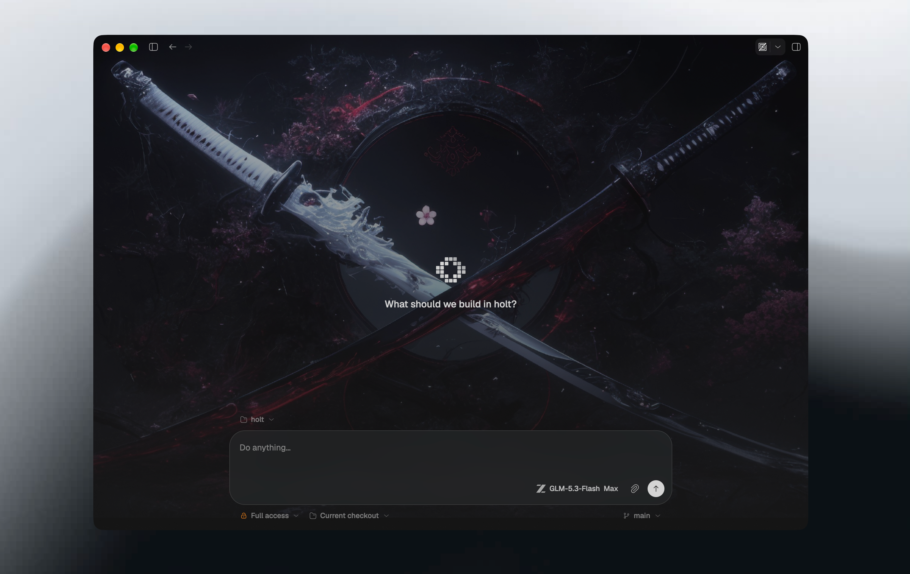

<p align="center">
  
</p>

<h1 align="center">Holt</h1>

<p align="center">
  基于 Rust 和 GPUI 构建的原生桌面 coding agent。
</p>

<p align="center">
  <a href="README.md">English</a> · 简体中文
</p>

<p align="center">
  <a href="LICENSE"></a>
  
</p>

<p align="center">
  
</p>

> [!WARNING]
> Holt 仍在开发中，是一个快速迭代的实验性项目。可能存在不完善之处，也可能出现不兼容的变更。

## 为什么是 Holt

为什么不呢。

- **一个 agent。** Holt 本身就是 agent，所有对话都由同一个 Rust agent loop
  驱动。模型服务以 provider 的形式接入；Holt 不包装其他 coding agent 的 CLI。
- **完全本地。** 没有云端、账号、同步，也没有遥测。对话、transcript 和凭据只存放在
  `~/.holt` 下。
- **单一进程。** 没有 daemon，也没有 CLI。原生桌面应用，后端通过类型化的内存 RPC
  传输嵌在同一进程内。

## 功能

- **自带模型**：内置 provider，也支持自定义 provider 和模型配置，在设置中修改即时生效，无需重启。
- **权限模式**：按对话设置，可逐项确认变更、交给模型审查，或授予完全访问权限。读操作始终不受限制。
- **Plan 模式**：agent 先检查工作区并写出计划，经你批准后才开始改动。
- **逐 Turn 审查**：每个 Turn 的变更集都带 diff；内置 git2 后端，支持分支、checkout diff、历史记录和 fetch。
- **可扩展**：支持标准 skill 目录下的 skills、MCP server、subagent，以及可切换的网页搜索（智谱、博查、Brave）。
- **内置终端**：终端面板归属于对话，显示在 transcript 旁边。

## 安装

从 [Releases](https://github.com/Onion-L/holt/releases/latest) 下载适合你 Mac
（Apple Silicon 或 Intel）的 DMG，安装包已签名并经过公证。目前仅支持 macOS。

开始运行前，先在 **Settings → Providers** 中添加 API key。

### 从源码构建

需要 macOS 和 stable Rust（版本已在 `rust-toolchain.toml` 中固定）。

```bash
cargo run --release -p holt
```

数据存放在 `~/.holt`，可通过 `HOLT_DATA_DIR` 修改。

## 架构

```
gpui UI ── in-memory RPC (ndjson envelopes) ── LocalEngine + core agent loop
```

UI 只在启动时链接 `crates/engine` 来组装本地后端，功能代码不直接调用后端逻辑。其余通信都走
`crates/rpc` 中的类型化协议；`crates/engine` 在 `RpcService` trait 后面适配
`crates/core`（`pi-core-rs`），因此替换成其他后端时不需要改动 UI。

| Crate | 职责 |
| --- | --- |
| `apps/holt` | 可执行程序，没有 CLI。 |
| `crates/ui` | gpui 视图层，与具体 agent 无关，负责渲染 `holt-doc` 中的 `MessagePart`。 |
| `crates/engine` | 后端适配层：agent loop、provider、凭据、git、skills、终端。 |
| `crates/core` | Agent 核心（`pi-core-rs`）：provider、流式传输、agent loop、harness。pi v0.84.4 的 Rust 移植版，归 Holt 所有。 |
| `crates/rpc` | 类型化控制面：分帧、分发、内存传输。 |
| `crates/proto` | 共享的协议类型和领域类型。 |
| `crates/doc` | Transcript 和 History 的传输类型（`MessagePart`、`TranscriptFrame`）。磁盘上的数据是普通 JSON/JSONL，由 `crates/engine` 负责。 |
| `crates/theme`、`crates/syntax` | 主题库和语法高亮。 |

完整的 RPC 协议及其背后的设计决策见 [ARCHITECTURE.md](ARCHITECTURE.md)。

## 开发

```bash
cargo fmt --all --check
cargo check --workspace
cargo clippy --workspace --all-targets -- -D warnings
cargo test --workspace
```

## 贡献

请阅读 [CONTRIBUTING.md](CONTRIBUTING.md)，并遵守[行为准则](CODE_OF_CONDUCT.md)。发现安全问题？请通过
[SECURITY.md](SECURITY.md) 私下报告。

## 致谢

漂亮的 UI 来自 [comet](https://github.com/zeronsh/comet) ❤️
